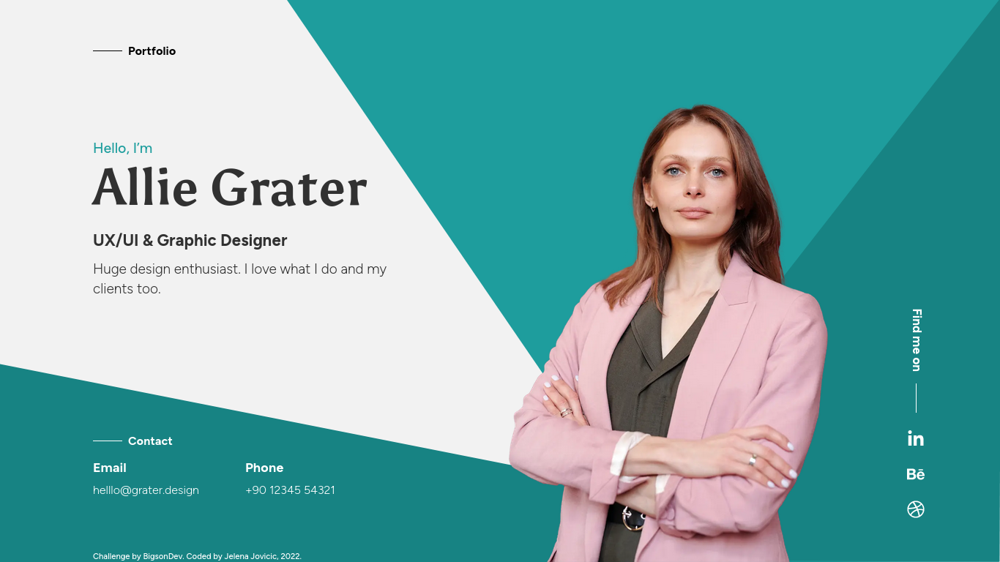

# BigsonDev - Business Card Project

This is a solution to the [BigsonDev Business Card Project](https://bigsondev.com/projects/business-card-project/). 

## Table of contents

- [Overview](#overview)
  - [Description](#description)
  - [Screenshot](#screenshot)
  - [Links](#links)
- [The process](#the-process)
  - [Built with](#built-with)
  - [Observations](#observations)
  - [Useful resources](#useful-resources)
- [Author](#author)

## Overview

### Description

This is a conversion of Adobe XD design to HTML and my first SASS project.

Project requirements:

- [x] The website looks similar to the design (Desktop and Mobile) and is available for users through a link.
- [x] Icons should be clickable and redirect users to external pages in a new tab.

Additional requirements:

- [x] Users can click on the email and the email client will open.
- [x] Users can click on phone and it'll start the call (on a mobile device).
- [] Best to introduce icons next to text for the above.
- [] Introduce e.g. Fade In animation.

### Screenshot

### Links

- [Repo](https://github.com/je-jo/business-card-project)
- [Live Site](https://je-jo.github.io/business-card-project/)

## My process

### Built with

- Semantic HTML5 markup
- SASS
- CSS Grid
- Flexbox
- Mobile-first workflow

### Observations

- ...

### Useful resources

- [nucliweb/image-element](https://github.com/nucliweb/image-element) - A repo showing best practices for web images.
- [CSS Logical Properties and Values](https://developer.mozilla.org/en-US/docs/Web/CSS/CSS_Logical_Properties) - If writing mode is changed, logical properties must be used instead of physical.
- [Fluid typography calculator](https://royalfig.github.io/fluid-typography-calculator/)

## Author

- [Github](https://github.com/je-jo)
- [Frontend Mentor](https://www.frontendmentor.io/profile/je-jo)
- [Codepen](https://codepen.io/je-jo)
- [Twitter](https://twitter.com/jelena_jo_)